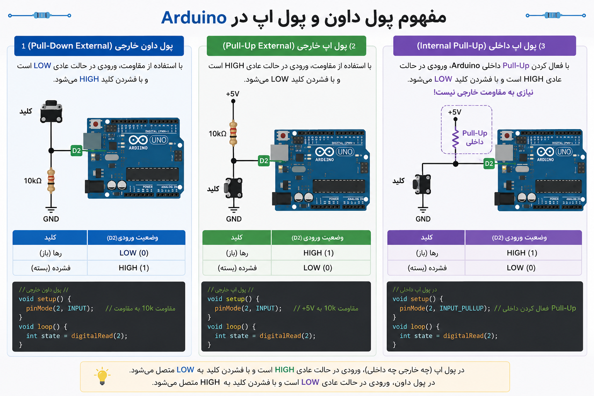

# Project 05 — Fire Alarm System: Smoke Detection with MQ-2


## 1. What Are We Building?

We will build a **fire and smoke alarm system** that:

- Continuously reads the air quality using an **MQ-2 gas/smoke sensor**
- Shows **green light** when air is clean (normal state)
- Switches to **red light + buzzer alarm** when smoke or gas is detected
- Keeps the alarm active until a **reset button** is pressed
- Prints live sensor readings to the **Serial Monitor** for debugging and calibration

This is a real-world system. Variations of this exact circuit are used in home smoke
detectors, industrial gas monitors, and air quality stations.

---

## 2. What Will You Learn?

By the end of this project you will be able to:

- Explain how the **MQ-2 sensor** works and what it detects
- Use `analogRead()` to read a sensor and compare it to a **threshold**
- Use `tone()` and `noTone()` to generate sounds with a buzzer
- Build a simple **two-state system**: NORMAL and ALARM
- Use a **latch** (alarm lock) so the alarm stays on until manually reset
- Apply **sensor calibration**: finding the right threshold for your environment
- Combine multiple inputs and outputs in a single, coordinated sketch

---

## 3. Components Needed

| Quantity | Component | Notes |
|----------|-----------|-------|
| 1 | Arduino Uno | Any compatible clone |
| 1 | MQ-2 Gas / Smoke Sensor module | The module version (with breakout board) is easiest |
| 1 | Red LED | Alarm indicator |
| 1 | Green LED | Normal / standby indicator |
| 1 | Buzzer (passive) | Must be **passive** for `tone()` to work |
| 1 | Push button | Reset / silence button |
| 2 | 220 Ω resistors | One for each LED |
| 1 | 10 kΩ resistor | Pull-down for the button |
| 1 | Breadboard | Half-size or full-size |
| Several | Jumper wires | |
| 1 | USB cable | |

### Active vs. Passive Buzzer — What Is the Difference?

| Type | How It Works | Controlled By | Sound |
|------|-------------|---------------|-------|
| **Active** buzzer | Has internal oscillator, beeps at fixed frequency | `digitalWrite()` HIGH/LOW | One fixed tone |
| **Passive** buzzer | Just a speaker element, no oscillator | `tone(pin, frequency)` | Any frequency you choose |

> We use a **passive buzzer** in this project so we can vary the alarm frequency —
> a rising tone sounds more urgent than a flat beep. If you only have an active buzzer,
> replace `tone()` / `noTone()` with `digitalWrite()` HIGH / LOW.

---

## 4. Key Concepts

### 4.1 How the MQ-2 Sensor Works

The MQ-2 is a **metal oxide semiconductor (MOS)** gas sensor. Inside it, a small
heating element raises a tin dioxide (SnO₂) layer to a high temperature. In clean air,
this material has a high electrical resistance. When smoke, LPG, methane, or other
gases are present, they react with the surface and **lower the resistance**.

The module converts this resistance change into a **voltage** that Arduino reads.

**The MQ-2 detects:**

| Gas / Substance | Common Source |
|-----------------|---------------|
| Smoke | Fire, cigarettes |
| LPG | Gas cylinders, leaks |
| Methane (CH₄) | Natural gas, biogas |
| Propane | Camping gas, lighters |
| Hydrogen | Batteries, chemical labs |
| Alcohol vapors | Solvents, ethanol |

> ⚠️ The MQ-2 **does not detect CO₂** (carbon dioxide). For fire detection specifically,
> it responds best to **smoke particles and combustion byproducts**.

### 4.2 The MQ-2 Module Pinout

The breakout board version has 4 pins:

| Pin | Function | Connect To |
|-----|----------|------------|
| **VCC** | Power | Arduino **5V** |
| **GND** | Ground | Arduino **GND** |
| **AO** (Analog Out) | Analog voltage (0–5V) | Arduino **A0** |
| **DO** (Digital Out) | HIGH/LOW based on onboard threshold pot | Not used in this project |

> We use the **AO pin** because it gives us the full range of sensor readings (0–1023).
> The DO pin gives only a simple HIGH/LOW and is less flexible.

### 4.3 Warm-Up Time

The MQ-2 requires a **heating element** to reach operating temperature.

- **First-time use:** allow **24–48 hours** of burn-in for best accuracy
- **Each power-on:** allow **at least 60–120 seconds** of warm-up before readings are reliable

During warm-up, readings will be unstable and often falsely high.

> In our code, we will add a short warm-up delay at startup and print a message
> to the Serial Monitor so the user knows to wait.

### 4.4 Threshold-Based Decision Making

Our alarm decision is simple:

```
sensor value  ≥  threshold   →   ALARM state
sensor value  <  threshold   →   NORMAL state
```

This is a **threshold comparator** — one of the most common patterns in embedded
systems and control engineering.

Choosing the right threshold is called **calibration** and is covered in Section 8.

### 4.5 The Alarm Latch

In a real alarm system, the alarm should **stay on** even if the smoke briefly
clears — until a human confirms the situation is safe and manually resets it.

We implement this with a **boolean latch variable**:

```cpp
bool alarmActive = false;   // starts OFF

// To trigger:
if (sensorValue >= THRESHOLD) {
    alarmActive = true;     // latch ON
}

// To reset (only via button):
if (buttonPressed) {
    alarmActive = false;    // latch OFF
}
```

Once `alarmActive` becomes `true`, it stays `true` until the reset button is pressed —
regardless of whether the sensor still reads smoke.

### 4.6 `tone()` and `noTone()`

These are built-in Arduino functions for generating sound with a passive buzzer:

```cpp
tone(pin, frequency);          // Start playing a tone at given frequency (Hz)
tone(pin, frequency, duration);// Play for a specific duration (ms), then stop
noTone(pin);                   // Stop playing
```

| Frequency | Sound |
|-----------|-------|
| 262 Hz | Middle C (musical note) |
| 1000 Hz | Mid-range beep |
| 2000 Hz | Higher-pitched alarm |
| 4000 Hz | High-pitched, attention-grabbing |

Human hearing range: approximately 20 Hz – 20,000 Hz.
For alarms, frequencies between **1000–4000 Hz** are most effective.

---

## 5. Hardware Setup

### Circuit Description

```
Component          Arduino Pin
─────────────────────────────────
MQ-2  VCC    ───── 5V
MQ-2  GND    ───── GND
MQ-2  AO     ───── A0

Red   LED    ───── [220Ω] ──── Pin 8  (anode)
              └────────────── GND    (cathode)

Green LED    ───── [220Ω] ──── Pin 7  (anode)
              └────────────── GND    (cathode)

Buzzer  (+)  ───── Pin 9
Buzzer  (–)  ───── GND

Button  leg1 ───── Pin 2
Button  leg2 ───── GND
             also ─ [10kΩ] ─── 5V   (pull-down — see note below)
```

### Button Wiring: Pull-Down Resistor



We wire the button with a **pull-down resistor** (10 kΩ to 5V):

- Button **not pressed** → Pin 2 reads **LOW** (connected to GND through resistor)
- Button **pressed** → Pin 2 reads **HIGH** (connected directly to 5V)

This is the opposite of `INPUT_PULLUP` (used in Project 02). Either approach works —
what matters is knowing which state means "pressed" in your code.

> **Why not just connect button to 5V with no resistor?**  
> Without a resistor, when the button is not pressed, pin 2 is floating — it picks
> up electrical noise and reads random HIGH/LOW values. The pull-down resistor keeps
> it firmly at LOW when released.

### MQ-2 Warm-Up LED Indicator

During the warm-up period, we will **blink the green LED slowly** to signal to the
user that the system is initializing. Solid green means the system is ready.


---

## 6. The Code

### Version 1 — Basic Threshold Alarm

```cpp
// ── Pin Definitions ──────────────────────────────────────────
const int SMOKE_PIN   = A0;   // MQ-2 analog output
const int RED_LED     = 8;    // Alarm LED
const int GREEN_LED   = 7;    // Normal / standby LED
const int BUZZER_PIN  = 9;    // Passive buzzer
const int RESET_BTN   = 2;    // Reset button

// ── Alarm Threshold ──────────────────────────────────────────
// 0–1023 range. Adjust this value during calibration (see Section 8).
const int THRESHOLD   = 400;

// ── Warm-up Time ─────────────────────────────────────────────
const int WARMUP_SEC  = 60;   // Seconds to wait for sensor to stabilize

void setup() {
  pinMode(RED_LED,    OUTPUT);
  pinMode(GREEN_LED,  OUTPUT);
  pinMode(BUZZER_PIN, OUTPUT);
  pinMode(RESET_BTN,  INPUT);    // Pull-down wiring: HIGH = pressed

  Serial.begin(9600);
  Serial.println("MQ-2 Fire Alarm System — Starting up...");

  // ── Warm-up sequence ─────────────────────────────────────
  Serial.print("Warming up sensor (");
  Serial.print(WARMUP_SEC);
  Serial.println(" seconds)...");

  for (int i = 0; i < WARMUP_SEC; i++) {
    digitalWrite(GREEN_LED, HIGH);
    delay(500);
    digitalWrite(GREEN_LED, LOW);
    delay(500);
    Serial.print(WARMUP_SEC - i);
    Serial.println(" seconds remaining...");
  }

  digitalWrite(GREEN_LED, HIGH);    // Solid green: system ready
  Serial.println("System READY. Monitoring...");
}

void loop() {
  int   sensorValue = analogRead(SMOKE_PIN);
  int   btnState    = digitalRead(RESET_BTN);

  // ── Print reading to Serial Monitor ──────────────────────
  Serial.print("Smoke level: ");
  Serial.print(sensorValue);
  Serial.print(" / 1023  |  Threshold: ");
  Serial.println(THRESHOLD);

  // ── Alarm Trigger ─────────────────────────────────────────
  if (sensorValue >= THRESHOLD) {
    // ALARM STATE
    digitalWrite(GREEN_LED, LOW);
    digitalWrite(RED_LED,   HIGH);
    tone(BUZZER_PIN, 2000);          // 2000 Hz alarm tone
    Serial.println("!!! SMOKE DETECTED — ALARM ACTIVE !!!");
  } else {
    // NORMAL STATE
    digitalWrite(RED_LED,   LOW);
    digitalWrite(GREEN_LED, HIGH);
    noTone(BUZZER_PIN);
  }

  delay(500);    // Read sensor every 500 ms
}
```

---

### Version 2 — With Alarm Latch and Reset Button

```cpp
// ── Pin Definitions ──────────────────────────────────────────
const int SMOKE_PIN   = A0;
const int RED_LED     = 8;
const int GREEN_LED   = 7;
const int BUZZER_PIN  = 9;
const int RESET_BTN   = 2;

// ── Alarm Settings ────────────────────────────────────────────
const int THRESHOLD        = 400;
const int ALARM_FREQ_LOW   = 1500;    // Hz — alternating tones for urgency
const int ALARM_FREQ_HIGH  = 3000;    // Hz
const int TONE_INTERVAL    = 300;     // ms between tone changes
const int WARMUP_SEC       = 60;

// ── State Variable ────────────────────────────────────────────
bool alarmActive  = false;            // Latch: stays true until reset
bool toneToggle   = false;            // Alternates buzzer frequency

void setup() {
  pinMode(RED_LED,    OUTPUT);
  pinMode(GREEN_LED,  OUTPUT);
  pinMode(BUZZER_PIN, OUTPUT);
  pinMode(RESET_BTN,  INPUT);

  Serial.begin(9600);
  Serial.println("=== MQ-2 Fire Alarm System ===");
  Serial.println("Initializing...");

  // Warm-up
  for (int i = 0; i < WARMUP_SEC; i++) {
    digitalWrite(GREEN_LED, HIGH);  delay(500);
    digitalWrite(GREEN_LED, LOW);   delay(500);
  }

  digitalWrite(GREEN_LED, HIGH);
  Serial.println("System READY.");
}

void loop() {
  int sensorValue = analogRead(SMOKE_PIN);
  int btnState    = digitalRead(RESET_BTN);

  // ── 1. Check reset button ─────────────────────────────────
  if (btnState == HIGH && alarmActive) {
    alarmActive = false;
    noTone(BUZZER_PIN);
    digitalWrite(RED_LED, LOW);
    digitalWrite(GREEN_LED, HIGH);
    Serial.println("Alarm RESET by user.");
    delay(500);                        // Debounce
  }

  // ── 2. Check sensor ───────────────────────────────────────
  if (sensorValue >= THRESHOLD) {
    alarmActive = true;                // Latch the alarm ON
  }

  // ── 3. Drive outputs based on state ──────────────────────
  if (alarmActive) {
    digitalWrite(GREEN_LED, LOW);
    digitalWrite(RED_LED,   HIGH);

    // Alternate between two frequencies for a more urgent sound
    toneToggle = !toneToggle;
    if (toneToggle) {
      tone(BUZZER_PIN, ALARM_FREQ_HIGH);
    } else {
      tone(BUZZER_PIN, ALARM_FREQ_LOW);
    }

    Serial.print("ALARM ACTIVE | Sensor: ");
    Serial.println(sensorValue);

  } else {
    digitalWrite(RED_LED,   LOW);
    digitalWrite(GREEN_LED, HIGH);
    noTone(BUZZER_PIN);

    Serial.print("Normal | Sensor: ");
    Serial.println(sensorValue);
  }

  delay(TONE_INTERVAL);
}
```

---

## 7. How the Code Works — Step by Step

### System State Diagram

```
                    ┌─────────────────────┐
   Power ON ──────► │   WARM-UP STATE     │
                    │  Green LED blinks   │
                    │  60 seconds         │
                    └────────┬────────────┘
                             │ warm-up done
                             ▼
                    ┌─────────────────────┐
              ┌───► │    NORMAL STATE     │ ◄─── Reset button pressed
              │     │  Green LED solid    │
              │     │  Buzzer OFF         │
              │     └────────┬────────────┘
              │              │ sensorValue ≥ THRESHOLD
              │              ▼
              │     ┌─────────────────────┐
              │     │    ALARM STATE      │
              │     │  Red LED ON         │
              │     │  Buzzer alternating │
              │     │  alarmActive = true │
              └─────┤  (stays here until  │
                    │   button pressed)   │
                    └─────────────────────┘
```

### Key Logic Explained

**Why check the reset button BEFORE the sensor?**

If we check the sensor first, and smoke is still present when the button is pressed,
the alarm would immediately re-trigger on the same loop iteration. Checking reset first
gives the user one clean loop cycle where the alarm is off.

**Why is `alarmActive` a `bool` and not an `int`?**

`bool` can only be `true` or `false`. This makes the code's intent clear —
it represents a state (alarm on/off), not a measurement. Using `int` would work
but is less readable and leaves room for accidental values like 2 or -1.

**What does `toneToggle = !toneToggle` do?**

The `!` operator means logical NOT. It flips a boolean:
- If `toneToggle` was `false`, it becomes `true`
- If `toneToggle` was `true`, it becomes `false`

Every loop iteration, it switches between the two alarm frequencies, creating
a two-tone alternating siren sound.

---

## 8. Calibrating the Sensor

Calibration is the process of finding the right **threshold value** for your specific
environment. This step is essential — the correct threshold depends on:

- Your room's baseline air quality
- The age and condition of the sensor
- Altitude and humidity
- What exactly you want to detect (smoke vs. gas leak)

### Step 1 — Measure Your Baseline

Upload Version 1 of the code with a very high threshold (e.g., `THRESHOLD = 1000`)
so the alarm never triggers. Open the Serial Monitor. Let the sensor warm up fully.
Note the readings in clean air — this is your **baseline**.

*Typical baseline in clean indoor air: 50–200*

### Step 2 — Measure Triggered Readings

Carefully bring a small source of smoke near the sensor (e.g., briefly wave
a freshly blown-out candle nearby). Note the peak readings.

*Typical smoke reading: 300–700+*

### Step 3 — Set the Threshold

Set your threshold **above** the baseline but **below** the smoke reading.
A common approach:

```
threshold = baseline + (smoke_peak - baseline) / 2
```

For example: baseline = 100, smoke peak = 500 → threshold = 100 + 200 = **300**

### Step 4 — Test and Adjust

Test the alarm with your chosen threshold. Adjust if you get:
- **False positives** (alarm triggers without smoke) → increase threshold
- **Missed detections** (alarm does not trigger with smoke) → decrease threshold

> ⚠️ Never test with actual fire. Use a blown-out candle, incense stick,
> or a small burst of aerosol spray held at a safe distance.

---

## 9. Exercises & Challenges

### Exercise 1 — Read the Baseline ⭐

Without writing any alarm logic, write a sketch that:
- Reads the MQ-2 sensor every 500 ms
- Prints the raw value to the Serial Monitor
- Also prints `"HIGH"` or `"LOW"` depending on whether the value is above 400

Use this to observe your sensor's real baseline in your classroom environment.

---

### Exercise 2 — Alert Levels ⭐⭐

Modify Version 2 to have **three levels** instead of two:

| Level | Sensor Value | Red LED | Green LED | Buzzer |
|-------|-------------|---------|-----------|--------|
| Normal | < 300 | OFF | ON | Silent |
| Warning | 300–500 | Blinking | OFF | Slow beep (500 ms on/off) |
| Alarm | > 500 | ON | OFF | Continuous high tone |

*Hint: Use `else if` to add the middle condition.*

---

### Exercise 3 — Buzzer Melody on Reset ⭐⭐

When the reset button is pressed and the alarm clears, play a short
**two-note confirmation melody** (e.g., 1000 Hz for 100 ms, then 1500 Hz for 100 ms)
before going silent.

*Hint: Use `tone(pin, freq, duration)` with the duration argument.*

---

### Exercise 4 — Sensor Averaging ⭐⭐

A single noisy reading can cause false alarms. Instead of reading the sensor once,
**average 10 readings** taken 10 ms apart:

```cpp
int total = 0;
for (int i = 0; i < 10; i++) {
    total += analogRead(SMOKE_PIN);
    delay(10);
}
int avgValue = total / 10;
```

Replace `sensorValue` with `avgValue` in your alarm logic.
Does this make the system more or less sensitive to brief smoke puffs?

---

### Exercise 5 — Alarm Duration Counter ⭐⭐⭐

Add a variable that **counts how many seconds the alarm has been active**.
Print this to the Serial Monitor:

```
ALARM ACTIVE | Sensor: 487 | Duration: 12 seconds
```

*Hint: Increment a counter variable every loop iteration and multiply by `TONE_INTERVAL / 1000.0`.*

---

### Bonus Challenge — Percentage Display ⭐⭐⭐

The raw value (0–1023) is not intuitive. Use `map()` to convert it to a percentage:

```cpp
int percent = map(sensorValue, 0, 1023, 0, 100);
```

Print the reading as:

```
Air quality: 23% | Status: Normal
Air quality: 61% | Status: ALARM
```

Also draw a simple **bar graph** in the Serial Monitor using a loop that prints
one `#` character per 5% of reading.

---

## 10. Common Mistakes & Troubleshooting

### Alarm Triggers Immediately at Power-On

| Possible Cause | Solution |
|----------------|----------|
| Sensor not warmed up | Wait the full warm-up time before testing |
| Threshold too low | Increase `THRESHOLD` value; run Exercise 1 to measure your baseline |
| First-time sensor use | Allow 24–48 hours of burn-in; readings stabilize with use |
| Sensor near a heat source | Move it away from direct sunlight, hot air vents, or soldering stations |

---

### Alarm Never Triggers Even with Smoke

| Possible Cause | Solution |
|----------------|----------|
| AO pin not connected | Check wiring from MQ-2 AO to Arduino A0 |
| Threshold too high | Decrease `THRESHOLD`; observe Serial Monitor readings with smoke present |
| Using DO instead of AO | Make sure you are reading from the **AO** (analog) pin, not DO |
| Sensor defective or cold | Check if sensor heats up after a few seconds — the top should feel warm |

---

### Reset Button Does Not Work

| Possible Cause | Solution |
|----------------|----------|
| Button wired incorrectly | Check that one leg goes to Pin 2, the other to GND, and 10kΩ to 5V |
| Code reads `LOW` as pressed | With pull-down wiring, pressed = `HIGH` — verify the condition in `if` |
| Button bounce | Add `delay(500)` after detecting a button press |
| Alarm immediately re-triggers | Smoke is still present — the latch resets but sensor immediately re-latches |

---

### Buzzer Makes No Sound

| Possible Cause | Solution |
|----------------|----------|
| Active buzzer used with `tone()` | Active buzzers need `digitalWrite(BUZZER_PIN, HIGH)` — not `tone()` |
| Buzzer polarity wrong | Most buzzers have a (+) marking — connect to signal pin, (–) to GND |
| Wrong pin | Confirm `BUZZER_PIN` in code matches the physical pin |
| `noTone()` called before sound plays | Check that `alarmActive` is `true` when buzzer code runs |

---

### Serial Monitor Shows Garbage Characters

| Possible Cause | Solution |
|----------------|----------|
| Wrong baud rate | Set Serial Monitor baud rate to **9600** to match `Serial.begin(9600)` |

---


### New Functions Introduced

| Function | Syntax | Purpose |
|----------|--------|---------|
| `tone()` | `tone(pin, frequency)` | Play a tone at given Hz on a passive buzzer |
| `tone()` | `tone(pin, frequency, duration)` | Play tone for a set duration then stop |
| `noTone()` | `noTone(pin)` | Stop the buzzer |
| `map()` | `map(value, fromLow, fromHigh, toLow, toHigh)` | Re-scale a value to a new range |

---
## Additional Resources


[](https://www.youtube.com/watch?v=SqONrFwa4PA)